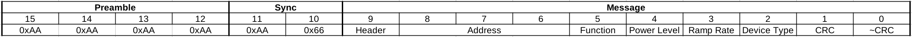
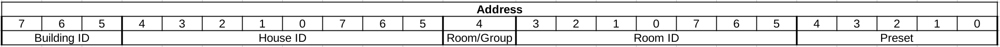

# Background
Due to the Adorne RF switches being discontinued by Legrand and wanting to be able to expand my lighting system in the future, I decided to reverse engineer the RF portion.

# Hardware
The RF portion of the system uses the TI CC1110 chip.

# RF Info
As per the FCC test reports

Operating frequencies: 904.861-924.873 MHz
 
Modulation: FSK Synchronous Manchester Encoded
 
Channels: 5

Three of the channels are listed in the report
|Channel|Frequency|
|---|---|
|Low|904.861 MHz|
|Mid|918.869 MHz|
|High|924.873 MHz|

Channel seperation is also listed in the report which can be used to calculate the rest of the frequencies.

|Channel|Frequency|
|---|---|
|1|904.861 MHz|
|2|910.811 MHz|
|3|918.869 MHz|
|4|922.519 MHz|
|5|924.873 MHz|

# Reversing
## Manual Decode
Recorded an RF transmission using gqrx and an RTL-SDR.  The transmission was decoded using inspecturm.  Several more transmissions were captured from different switches to verify decoding was correct.

Manual decode of preamble and sync

Tried to send a light on/off command using RfCat on only 924.873 MHz, but this did not work to control the switches.

## Channel Sequence
As per SP-adorneGuideFo-AD.pdf

I don't see anything in the TI CC1110 datasheet that would allow it to transmit on multiple frequencies simultaneously so I tried transmitting the same light on/off command with RfCat on each channel sequentially.  This also did not work to control the light switches.  Either the settings on the TI CC1111 are wrong or there is a frequency hopping sequence.

The RTL-SDR did not have enough bandwidth to look at all channels simultaneously so I picked up a HackRF One.  Recorded the signal with gqrx, center frequency = 914.850 MHz.

I had to remove the scale so channel 5 would be visible.  With scales turned on

This is the pattern that seems to repeat.  There are some other patterns that are a little different, but that could be from interference.  Channel 1 and channel 5 transmitting at the same time seems weird.

Tried transmitting channel sequence 2, 5, 4, 3, 5 and 2, 1, 4, 3, 1 with RfCat.  Both sequences work for turning switches on/off.

After trying different lengths of the channel sequence to see if on/off can be triggered with less than the full sequence, I noticed that the sequence 2, 5, 4, 3, 5 works consistently but 2, 1, 4, 3, 1 does not.

TestChannelSequence.py tries various channel sequences to toggle the switch and checks the data from the LCM to see if the switch is on or off.

While testing TestChannelSequence.py I noticed some channel sequences would cause the LCM to change the switch state but the actual switch did not change state.  Will need to add a voltage sensor on the output of a switch or use a light sensor to monitor a light controlled by the switch.

## Identify Frames
Used RfCat and a TI CC1111 dongle to capture all transmissions from the lighting system to identify other frames.

# Message Format
## Full Message

## Message

### Header

|Family|Value|
|---|---|
|Topdog F1|0b001|
|Topdog F2|0b110|

|Address Mode|Value|
|---|---|
|Broadcast|0b00|
|Anonymous Multicast|0b01|
|Unicast|0b10|
|Multicast|0b11|

### Address

|Room/Group|Value|
|---|---|
|Group|0b0|
|Room|0b1|

### Function
For turning switches on/off this will be a ramp command which has a value of 0x85

### Power Level
From 0x0 to 0xFF

### Ramp Rate
Rate for dimming

### Device Type
|Device|Value|
|---|---|
|Dimmer|0x41|
|Switch|0x42|
|Fan Controller|0x43|
|Network Remote|0x21|
|Scene Controller|0x2B|

### CRC
CRC of the message, computed from byte 9 to byte 2

### ~CRC
Inverted CRC

# To do
- [ ] Check CC1110 manual again to see if there is a way to transmit on channel 1 and channel 5 simultaneously.
- [ ] Decode some of the different patterns to verify if they are valid or caused by interference.
- [x] Try transmitting channel sequence 2, 5, 4, 3, 5 and 2, 1, 4, 3, 1 with RfCat.
- [ ] Capture data for adding a swtich to system with RfCat
